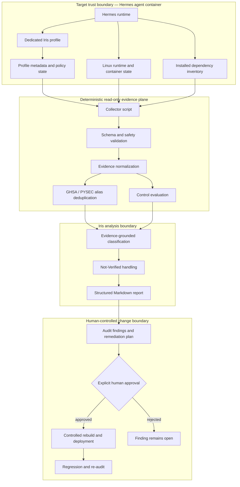

# Agentic AI Security Auditor — Iris

**言語:** [English](README.md) | 日本語

[](https://github.com/Lee2379/agentic-ai-security-auditor/actions/workflows/ci.yml)
[](https://www.python.org/)
[](https://www.docker.com/)
[](LICENSE)

Irisは、containerized Hermes multi-agent環境を対象とする独立したsecurity audit agentです。決定論的かつread-onlyなruntime evidenceを構造化監査レポートへ変換し、remediationは明示的な人間の承認境界より外側に置きます。

本リポジトリは、二つの相補的なレイヤーで構成されています。

| レイヤー | 目的 | 証拠 |
|---|---|---|
| Operational deployment | 稼働中のHermes環境におけるIris profile、runtime isolation、control state、scheduled execution、finding生成を示す | [`assets/evidence`](assets/evidence)のsanitized・hash-verified screenshots |
| Reproducible reference pipeline | private infrastructure、credential、network、LLM APIを使わず、監査手法を検査・test可能にする | Python package、synthetic evidence fixture、deterministic artifacts、tests、hardened Docker configuration |

> **Scope:** Hermes Agentはthird-party runtimeです。本リポジトリはその上に設計した監査role、evidence pipeline、control、evaluation、governanceを記録・再現するものであり、Hermes platform自体の著作を主張しません。

## 技術文書

| 文書 | Review対象 |
|---|---|
| [System design](docs/system-design.md) | 要件、trust boundary、evidence contract、component、failure handling、artifact lineage |
| [Control catalog](docs/control-catalog.md) | 16個のpredicate、期待状態、severity、現在結果、closure procedure |
| [Evaluation framework](docs/evaluation.md) | metric定義、test matrix、統計的解釈、agent output評価、production validation plan |
| [Methodology](docs/methodology.md) · [Threat model](docs/threat-model.md) | 監査stage、severity model、threat、asset、mitigation、residual risk、権限外の範囲 |

## システム概要

- bundled Skillを持たない専用`iris` profileと、明示的なsecurity-auditor persona
- credential値を読まず、対象を変更しない決定論的evidence collector
- UID/GID、Linux capability、seccomp、`NoNewPrivs`、Docker socket、sensitive file permission、approval policy、tool exposure、MCP configurationの検査
- GHSA/PYSEC aliasを統合するdependency advisory normalization
- evidence-aware classification: 未収集の状態はpassではなく**Not Verified**として扱う
- Hermes gateway／cron runtimeによる週次scheduled execution
- Executive Summary、Scope and Timestamp、Findings、Passed Controls、Limitations and Not-Verified Items、Risk Treatment、Remediation Verification Planから成るreport contract
- automatic remediationなし。package updateとcontainer changeはreview済みdeployment pathを必須とする

## Engineering課題と設計要件

同じmodelがevidenceを収集し、その十分性まで判定すると、security agentにはcircular trustが生じます。tool outputの欠落、同一CVEに対する複数advisory identifier、流暢な文章による観測事実と仮定の混同に加え、write accessを持つauditorは監査中に対象状態を変更し、自らの証拠を無効化する可能性があります。

Irisは次の設計要件でこれらを分離します。

| 要件 | 設計上の対応 | 検証面 |
|---|---|---|
| Evidence integrity | collectionを決定論的・read-onlyとし、安全宣言をschema validation | [`loader.py`](src/iris_agent_auditor/loader.py)、collector tests、公開transcript |
| Inflated risk countの防止 | package、CVE identity、fixed versionによりGHSA/PYSECを統合 | [`deduplicate.py`](src/iris_agent_auditor/deduplicate.py)、alias-pair fixture/tests |
| Factとinferenceの分離 | finding、passed control、Not Verifiedに分類 | [`controls.py`](src/iris_agent_auditor/controls.py)、report contract tests |
| Agent authorityの制限 | Skill、MCP、interactive CLI tool、remediation channelを持たせない | Operational evidence E-01〜E-03 |
| 再現性 | public pipelineはnetwork/model callなしでbyte比較可能なartifactを生成 | reference artifacts、comparison script、CI |
| Change governance | recommendationはhuman approvalで終了し、rebuild、regression test、re-auditを要求 | policy configuration、remediation verification plan |

## 責任分離

実運用agentと公開参照実装は、同じ役割を置き換えるのではなく、異なる責任を担います。

| Stage | Authority | 決定論的 | 対象状態を変更可能 | 主な出力 |
|---|---|---:|---:|---|
| Runtime evidence collection | 明示的command allowlistを持つshell collector | Yes | No | bounded evidence record |
| Contract validation | Python loader | Yes | No | accepted/rejected evidence |
| Advisory identity resolution | Python normalization／deduplication | Yes | No | canonical vulnerability set |
| Control evaluation | explicit policy predicates | Yes | No | passed controls、findings、Not Verified |
| Report synthesis | 実運用のIris／公開harnessのdeterministic renderer | Constrained | No | structured audit report |
| Remediation decision | human reviewerと通常のrelease process | Iris外 | approval後のみYes | reviewed rebuild/deployment |

LLMはruntime truthのsourceではなく、範囲を限定した解釈とcommunicationに使用します。公開rendererは同一report contractのinspectable baselineを提供し、private deploymentを公開せずregressionをtest可能にします。

## アーキテクチャ



collectorがfactを確立し、Irisは提供されたevidenceのみを解釈します。未観測の状態をpassed controlへ変換することも、findingを自動修復することも許可しません。

## 実装とartifact lineage

| Component | 責任 | Reject／detect対象 | Downstream consumer |
|---|---|---|---|
| [`collect_security_evidence.sh`](scripts/collect_security_evidence.sh) | runtime、policy、file、MCP、dependency stateをbounded read | command欠落を報告し、packageを自動installしない | evidence loader／scheduled Iris run |
| [`loader.py`](src/iris_agent_auditor/loader.py) | required sectionとcollector safety declarationを強制 | schema section欠落、credential read、state change、remediation宣言 | normalizer／evaluator |
| [`deduplicate.py`](src/iris_agent_auditor/deduplicate.py) | severity normalizationとadvisory alias resolution | database重複record、alias間のseverity不整合 | dependency finding builder |
| [`controls.py`](src/iris_agent_auditor/controls.py) | runtime／policy predicate評価 | root、capability、socket、seccomp、permissive policy、weak file mode、tool/MCP exposure | finding/report pipeline |
| [`pipeline.py`](src/iris_agent_auditor/pipeline.py) | evaluation順序、stable ID、metrics、artifact生成 | non-deterministic ordering、normalized outputへのraw duplicate混入 | CLI／CI |
| [`report.py`](src/iris_agent_auditor/report.py) | typed findingとmetricからgovernance report生成 | report-contract testによるrequired section欠落 | human reviewer |

Machine-readable finding contract:

```json
{
  "finding_id": "IRIS-DEP-001",
  "severity": "high",
  "asset": "aiohttp 3.14.1",
  "evidence": "canonical advisory, aliases, and fixed version",
  "risk": "bounded impact statement with reachability caveat",
  "recommendation": "controlled upgrade and regression test"
}
```

`evidence`は観測、`risk`は条件付きimpact、`recommendation`はreview対象のtreatmentを表します。scanner descriptionを無条件のoperational claimとして転記しないための分離です。

### Failure semantics

| Condition | Pipeline behavior | Reporting behavior |
|---|---|---|
| Required evidence section欠落 | evaluation前にfail | reportを生成しない |
| Credential access／mutationの安全宣言違反 | evidenceをreject | safety contract violation |
| Control evidenceがbaselineと不一致 | findingを生成して継続 | stable ID、severity、evidence、risk、recommendation |
| Evidence未収集 | passにせず継続 | explicit Not Verified |
| Duplicate advisory alias | recordを統合 | 全aliasを保持した一つのcanonical finding |
| Findingによりscannerがnon-zero exit | outputとexit codeを保持 | collectionは完了しfindingはopen |
| Remediation未検証 | findingをcloseしない | verification stepを未完了のまま保持 |

## 運用証跡

画像はすべてoriginal terminal captureから作成したprivacy-reviewed derivativeです。個人のshell promptと一時的execution IDを不透明maskで覆い、security-relevant command outputは保持しています。file integrityはCIで[`assets/evidence/manifest.json`](assets/evidence/manifest.json)により検証します。

### 1. Auditor identityとpolicy boundary


Iris profileはmission、evidence standard、severity model、必須report section、prohibited actionを明示します。human approvalなしのsystem modification、package installation、service control、delegation、secret disclosure、automatic remediationを禁止しています。

### 2. Multi-agent環境内のprofile isolation


profile registryでは、Irisがbusiness agentsとは別のagentとして登録されています。専用path、model binding、alias、`SOUL.md`、environment fileを持ち、bundled Skillは0です。ambient capabilityを減らし、監査roleを業務agentから分離しています。

### 3. Least privilege runtimeとfail-closed controls


re-auditでUID/GID `1000`、effective capability mask zero、seccomp active、Docker socket未mount、sensitive profile fileの`0600` owner-only permission、manual approval、cron approval deny、Tirith fail-closed、private URL block、lazy install disabled、CLI toolなしを確認しました。`NoNewPrivs=0`はpassにせず、openなdefense-in-depth findingとして保持します。

### 4. Scheduled controlのon-demand execution


週次監査jobはvalidation目的でmanual triggerできます。schedulerは実行成功と次回scheduleの両方を記録しています。

### 5. Scheduled agent runへ注入されたread-only evidence


cron transcriptにはschedule、delivery semantics、collector output、profile isolation、non-root runtime evidenceが記録されています。promptはIrisにpre-run evidenceのみを分析させ、tool callやstate changeを禁止します。

### 6. Structured findingsとpassed controls


reportはstable finding ID、severity、asset、evidence、risk、recommendationを付与します。同一issueのGHSA/PYSEC identifierは統合し、passed controlをlimitationと分けてconfidence boundaryを可視化しています。

### 7. Gatewayとschedulerの運用状態


gateway active、recurring job 1件を確認できます。同一runtimeにbusiness-agent profilesも存在し、Irisがmulti-agent deployment内の独立したassurance functionとして稼働していることを示します。

### 8. Weekly job registryとexecution record


週次schedule、local delivery、collector script binding、last-run status、next-run timeを確認できます。job／execution IDはcontrol designの検証に不要なためmaskしています。

## 公開fixtureが表す監査結果

synthetic fixtureはlive configurationやcredentialを公開せず、review済み監査の構造を再現します。

| 指標 | 結果 |
|---|---:|
| Raw dependency advisory records | 12 |
| Alias統合後のunique dependency vulnerabilities | 6 |
| Duplicate-record reduction | 50% |
| Container hardeningを含むtotal findings | 7 |
| Severity distribution | 3 High · 3 Moderate · 1 Low |
| Confirmed passed controls | 15 |
| Automatic remediation | None |

6件のdependency findingは`aiohttp`と`cryptography`のGitHub Security Advisoryに対応します。runtime reachabilityは未検証であり、vulnerable pathが本deploymentでexploitableだったとは主張しません。

## 定量評価

opaqueなcomposite risk scoreではなく、定義を公開したcountを使用します。

| Metric | 定義 | Reference value | 解釈 |
|---|---|---:|---|
| Alias reduction | `(raw advisory records - canonical vulnerabilities) / raw advisory records` | 50% | 重複GHSA/PYSEC 6件をrisk countから除外 |
| Finding count | canonical dependency findings + failed control predicates | 7 | dependency 6件 + runtime hardening gap 1件 |
| Severity distribution | normalization／alias統合後のcount | 3 High · 3 Moderate · 1 Low | individual findingを隠さず優先順位付け |
| Passed controls | direct evidenceを持つpositive predicate | 15 | missing evidenceは除外 |
| Not Verified | evidence不足のmaterial assessment area | 6 | report confidenceの境界を定義 |
| Artifact determinism | 4 reference filesのbyte equality | 4/4 | normalization、classification、metric、rendering driftを検知 |
| Automatic remediation | auditorが実行したstate change | 0 | assessmentとtreatmentの分離 |

14-test suiteはmalformed evidence rejection、collector safety、root classification、least privilege、CLI/MCP exposure、CVE-aware alias grouping、severity selection、output completeness、required governance section、normalized evidence shape、repository privacyを検証します。これは監査手法のregression suiteであり、外部benchmark上のvulnerability-detection recallを主張するものではありません。

## Scheduled audit lifecycle

1. Hermes schedulerが週次cadenceまたはoperator-triggered validation runでjobを開始。
2. pre-run collectorがsecret valueを読まず、対象を変更せずbounded evidenceを記録。
3. safety／schema validationが不完全またはmutation-bearing evidenceをreject。
4. advisoryをnormalizeし、count前にaliasを統合。
5. runtime／policyをexplicit predicateで評価し、未観測はNot Verifiedへ分類。
6. Irisがrequired sectionを持つreportを生成し、remediation itemをopenのまま保持。
7. human reviewerが通常のrelease processで変更をapprove／reject。
8. fresh collectionとregression runをclosure evidenceとし、version changeだけではfindingをcloseしない。

このlifecycleにより、observation、interpretation、authorization、deployment、verificationを分離したまま、scheduled agentをrepeatableかつreviewableにします。

## 監査の再現

### Local Python

```bash
python -m venv .venv
python -m pip install -e .
iris-audit evaluate \
  --input evidence/sample/collector.json \
  --output artifacts/local_run
```

生成物:

- `normalized_evidence.json` — canonical advisoryを含むvalidated evidence
- `findings.json` — machine-readable findings
- `metrics.json` — severity、control、deduplication counts
- `audit_report.md` — human-reviewable governance report

Reference artifactとの比較:

```bash
python scripts/compare_artifacts.py artifacts/sample_run artifacts/local_run
```

### Hardened offline container

```bash
docker compose run --rm audit
```

reference containerはUID/GID `10001`、all capabilities dropped、`no-new-privileges`、read-only root filesystem、network disabledで実行し、output directoryのみをmountします。これはportfolio harnessのcontrolであり、operational Hermes runtimeの観測値とは区別しています。

## 検証

```bash
python -m unittest discover -s tests -v
python scripts/privacy_scan.py .
python scripts/verify_evidence_images.py
bash -n scripts/collect_security_evidence.sh
docker build -t agentic-ai-security-auditor .
```

CIはtest suite、deterministic artifactの再生成とbyte比較、secret／PII pattern scan、全evidence imageのSHA-256 verification、collector syntax、non-root image buildを実行します。

## Privacyと公開control

- `.env`、token、token fingerprint、private endpoint、email address、private-network address、live configuration exportはcommitしない。
- sample evidenceはsyntheticだが構造的にrepresentative。
- screenshotはsanitized derivativeのみ公開し、originalはrepository外で管理。
- repository-wide privacy scannerがcredential／personal infrastructure patternを検知するとCIをfail。
- collectorはcredential値ではなく、存在とsecurity stateのみを出力。

Disclosure guidanceは[`SECURITY.md`](SECURITY.md)を参照してください。

## 制約事項

- defensive audit workflowであり、penetration testing systemではありません。
- public fixtureはvulnerable-code reachabilityやexploitabilityを証明しません。
- network policy、image signature、SBOM provenance、host isolation、secret rotationの評価には追加evidenceが必要です。
- LLMはsynthesisを改善できますがsource of truthではなく、deterministic evidenceとexplicit limitationを優先します。
- remediationはhuman-approved rebuild、test、re-auditが完了するまでopenです。

## Production拡張計画

1. collector payloadにversioned JSON Schemaを導入し、breaking changeをreject。
2. signed SBOMとimmutable image digestを収集し、provenanceをpolicyで検証。
3. dependency reachability／feature usage evidenceを追加してscanner findingを再優先順位付け。
4. network listener、egress policy、read-only-root、namespace、resource limitを評価。
5. retention、reviewer identity、remediation linkageを持つappend-only audit artifactを保存。
6. true/false control、malformed input、alias collision、missing observationを含むlabeled fixture corpusを構築。
7. LLM renderer使用時のcitation coverageとunsupported-claim rateを測定。
8. auditorにgeneral messaging authorityを与えないよう、alert delivery identityを分離。

## リポジトリ構成

```text
├── assets/evidence/        # sanitized・hash-verified operational evidence
├── artifacts/sample_run/   # deterministic reference output
├── config/                 # 公開可能なauditor policy
├── docs/                   # system design、control catalog、evaluation、threat model、sources
├── evidence/sample/        # synthetic collector fixture
├── scripts/                # collector、integrity／privacy verification
├── src/                    # reference audit pipeline
├── tests/                  # unit、integration、privacy、governance tests
├── compose.yaml            # network-disabled、read-only execution profile
└── Dockerfile              # non-root reproducible runtime
```

## ライセンス

MIT — [`LICENSE`](LICENSE)を参照してください。
