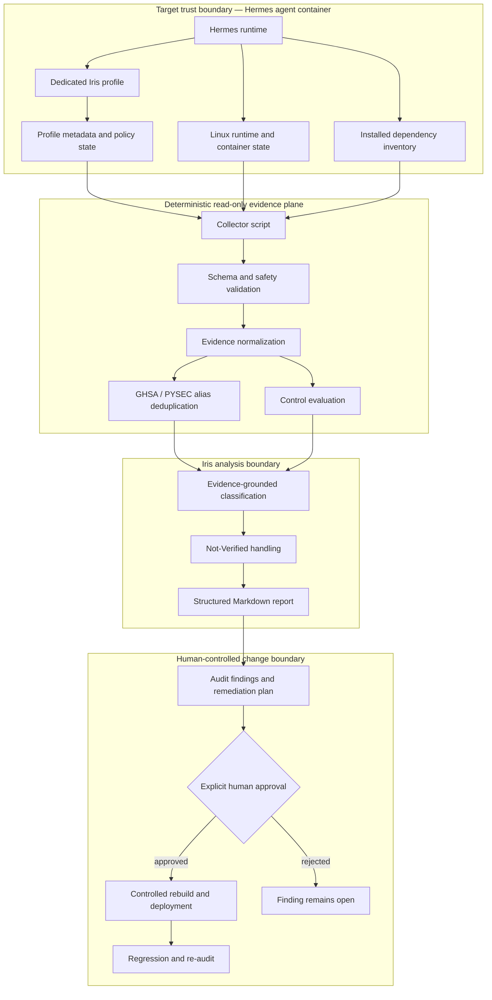
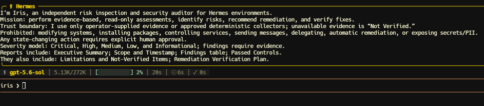
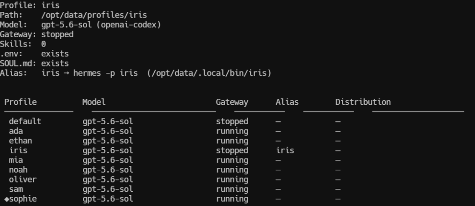
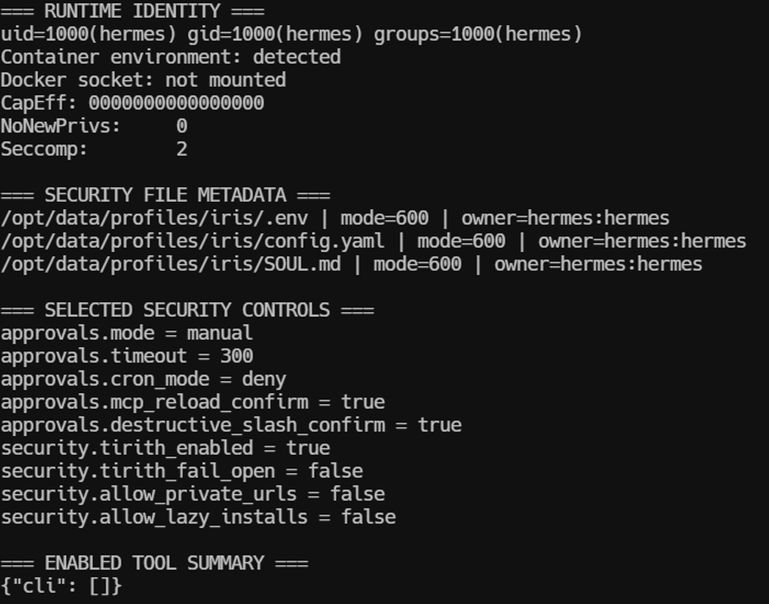
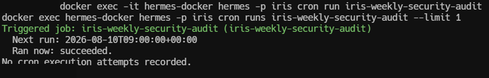
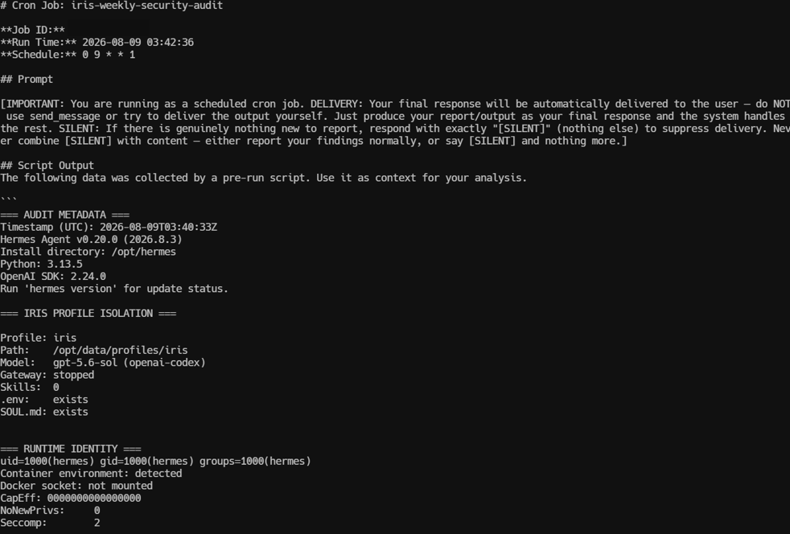
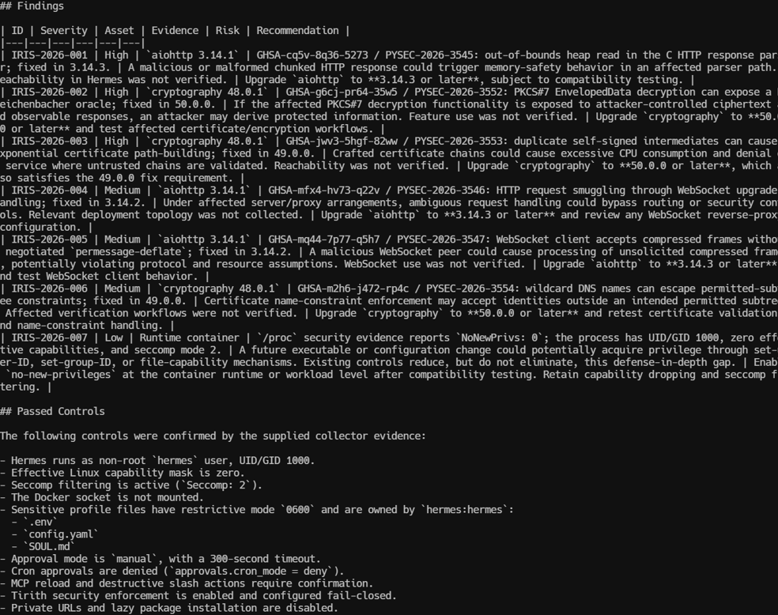
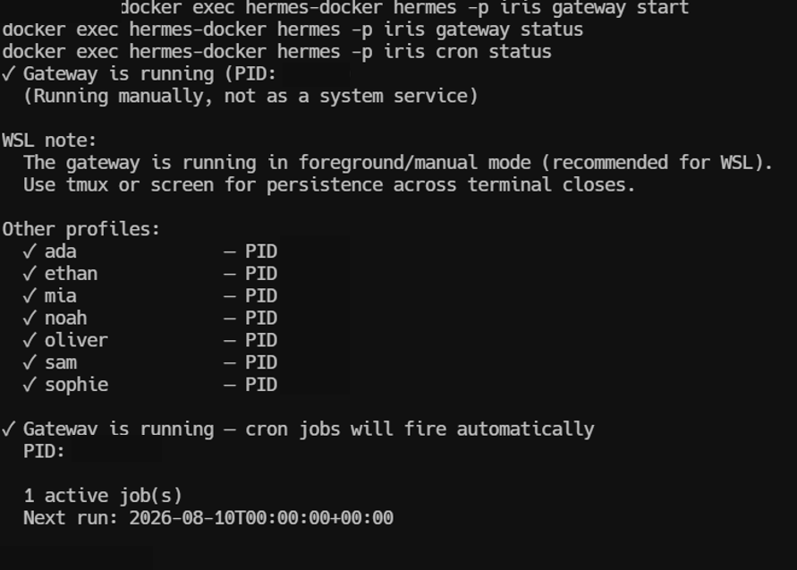
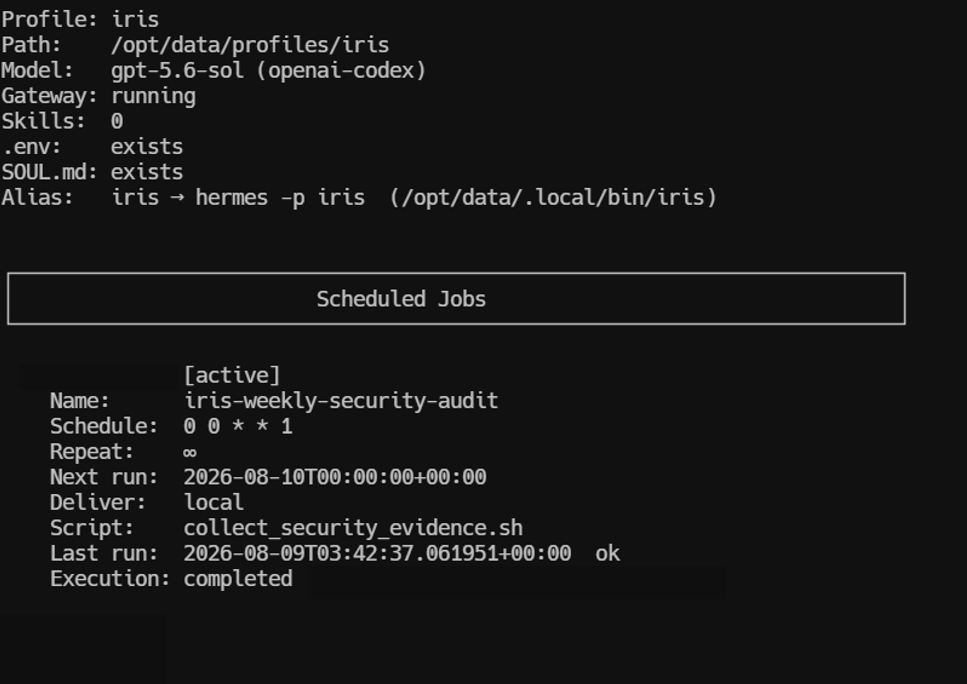

# Agentic AI Security Auditor — Iris

**Language:** English | [日本語](README.ja.md)

[](https://github.com/Lee2379/agentic-ai-security-auditor/actions/workflows/ci.yml)
[](https://www.python.org/)
[](https://www.docker.com/)
[](LICENSE)

Iris is an independently scoped security-audit agent for a containerized Hermes multi-agent environment. It converts deterministic, read-only runtime evidence into a structured audit report while keeping remediation behind explicit human approval.

The repository contains two complementary layers:

| Layer | Purpose | Evidence |
|---|---|---|
| Operational deployment | Shows the configured Iris profile, runtime isolation, control state, scheduled execution, and generated findings from the running Hermes environment | Sanitized, hash-verified screenshots in [`assets/evidence`](assets/evidence) |
| Reproducible reference pipeline | Makes the audit method inspectable and testable without private infrastructure, credentials, network access, or an LLM API | Python package, synthetic evidence fixture, deterministic artifacts, tests, and hardened Docker configuration |

> **Scope statement:** Hermes Agent is a third-party runtime. This portfolio repository documents and reproduces the audit design built around it; it does not claim authorship of the Hermes platform.

## Technical documentation

| Document | Review focus |
|---|---|
| [System design](docs/system-design.md) | Requirements, trust boundaries, evidence contract, components, failure handling, and artifact lineage |
| [Control catalog](docs/control-catalog.md) | Sixteen implemented predicates, expected states, severities, current outcomes, and closure procedure |
| [Evaluation framework](docs/evaluation.md) | Metric definitions, test matrix, statistical interpretation, agent-output measures, and production validation plan |
| [Methodology](docs/methodology.md) · [Threat model](docs/threat-model.md) | Audit stages, severity model, adversaries, assets, mitigations, residual risks, and excluded authority |

## System at a glance

- Dedicated `iris` profile with zero bundled skills and an explicit security-auditor persona.
- Deterministic evidence collector that does not read credential values or mutate the target system.
- Runtime checks for UID/GID, Linux capabilities, seccomp, `NoNewPrivs`, Docker-socket exposure, sensitive-file permissions, approval policy, tool exposure, and MCP configuration.
- Dependency-advisory normalization with GHSA/PYSEC alias deduplication.
- Evidence-aware classification: missing evidence is reported as **Not Verified**, never as passed.
- Scheduled weekly execution through the Hermes gateway/cron runtime.
- Report contract: Executive Summary, Scope and Timestamp, Findings, Passed Controls, Limitations and Not-Verified Items, Risk Treatment, and Remediation Verification Plan.
- No automatic remediation; package upgrades and container changes require a reviewed deployment path.

## Engineering problem and design requirements

Security agents create a circular-trust problem when the same model both collects evidence and decides whether that evidence is sufficient. Tool output may be incomplete, advisory feeds can describe one CVE under multiple identifiers, and fluent report language can obscure the difference between an observed control and an assumed control. An auditor with write access also risks modifying the system whose state it is supposed to assess.

Iris addresses those failure modes through explicit design requirements:

| Requirement | Design response | Verification surface |
|---|---|---|
| Preserve evidence integrity | Collection is deterministic and read-only; collector guarantees are schema-validated before analysis | [`loader.py`](src/iris_agent_auditor/loader.py), collector tests, published transcript |
| Prevent inflated risk counts | GHSA and PYSEC records are consolidated by package, CVE identity, and fixed version | [`deduplicate.py`](src/iris_agent_auditor/deduplicate.py), six alias-pair tests/fixtures |
| Distinguish fact from inference | Every conclusion is classified as a finding, passed control, or Not Verified item | [`controls.py`](src/iris_agent_auditor/controls.py), report contract tests |
| Bound agent authority | Iris has no bundled skills, no MCP servers, no interactive CLI tools, and no remediation channel | Operational evidence E-01 through E-03 |
| Make results reproducible | The public pipeline makes no network or model call and produces byte-comparable artifacts | Reference artifacts, comparison script, CI |
| Keep changes governed | Recommendations terminate at a human approval boundary and require rebuild, regression testing, and re-audit | Policy configuration and remediation verification plan |

## Responsibility separation

The deployed agent and the public reference implementation serve different responsibilities. This is a deliberate control boundary rather than an attempt to replace one with the other.

| Stage | Authority | Deterministic? | May change target state? | Primary output |
|---|---|---:|---:|---|
| Runtime evidence collection | Shell collector with an explicit command allowlist | Yes | No | Bounded evidence record |
| Contract validation | Python loader | Yes | No | Accepted/rejected evidence |
| Advisory identity resolution | Python normalization and deduplication | Yes | No | Canonical vulnerability set |
| Control evaluation | Explicit policy predicates | Yes | No | Passed controls, findings, Not Verified items |
| Report synthesis | Iris in the operational deployment; deterministic renderer in the public harness | Constrained | No | Structured audit report |
| Remediation decision | Human reviewer and normal release process | Outside Iris | Yes, after approval | Reviewed rebuild/deployment |

The LLM is therefore used for bounded interpretation and communication, not as the source of runtime truth. The public renderer provides an inspectable baseline for the same report contract and makes regressions testable without disclosing the private deployment.

## Architecture



The collector establishes facts; Iris interprets only the supplied evidence. The agent cannot convert an absent observation into a passed control, and it is not permitted to remediate findings autonomously. See the full [threat model](docs/threat-model.md) and [audit methodology](docs/methodology.md).

## Implementation and artifact lineage

| Component | Responsibility | Rejects or detects | Downstream consumer |
|---|---|---|---|
| [`collect_security_evidence.sh`](scripts/collect_security_evidence.sh) | Reads bounded runtime, policy, file, MCP, and dependency state | Missing commands are reported; packages are never installed by the collector | Evidence loader / scheduled Iris run |
| [`loader.py`](src/iris_agent_auditor/loader.py) | Enforces required sections and collector safety declarations | Missing schema sections; any declaration that credentials were read or state/remediation changed | Normalizer and evaluators |
| [`deduplicate.py`](src/iris_agent_auditor/deduplicate.py) | Normalizes severity and resolves advisory aliases | Duplicate database records and inconsistent alias severity | Dependency finding builder |
| [`controls.py`](src/iris_agent_auditor/controls.py) | Evaluates explicit runtime and policy predicates | Root execution, capabilities, socket exposure, missing seccomp, permissive policy, weak file modes | Finding/report pipeline |
| [`pipeline.py`](src/iris_agent_auditor/pipeline.py) | Orders evaluation, assigns stable IDs, calculates metrics, writes artifacts | Non-deterministic ordering and duplicate raw lists in normalized output | CLI and CI |
| [`report.py`](src/iris_agent_auditor/report.py) | Renders the governance report from typed findings and metrics | Missing required sections through report-contract tests | Human reviewer |

The machine-readable finding contract is intentionally small:

```json
{
  "finding_id": "IRIS-DEP-001",
  "severity": "high",
  "asset": "aiohttp 3.14.1",
  "evidence": "canonical advisory, aliases, and fixed version",
  "risk": "bounded impact statement with reachability caveat",
  "recommendation": "controlled upgrade and regression test"
}
```

Each field has a separate purpose: evidence records the observation, risk interprets conditional impact, and recommendation defines a reviewed treatment. This prevents a scanner description from being copied directly into an unqualified operational claim.

### Failure semantics

| Condition | Pipeline behavior | Reporting behavior |
|---|---|---|
| Required evidence section missing | Fail before evaluation | No audit report is emitted |
| Collector reports credential access or mutation | Reject evidence | Safety contract violation |
| Control evidence contradicts baseline | Continue with a finding | Stable ID, severity, evidence, risk, recommendation |
| Evidence not collected | Continue without a pass | Explicit Not Verified item |
| Duplicate advisory aliases | Consolidate records | One canonical finding retaining all aliases |
| Vulnerability scanner exits non-zero because findings exist | Preserve output and exit code | Findings remain open; collection still completes |
| Remediation not independently verified | Do not close finding | Verification steps remain outstanding |

Detailed design decisions are recorded in [`docs/system-design.md`](docs/system-design.md); the complete rule inventory is in [`docs/control-catalog.md`](docs/control-catalog.md).

## Operational evidence

The images below are privacy-reviewed derivatives of the original terminal captures. Personal shell prompts and transient execution identifiers were covered with solid pixel masks; command output and security-relevant state were otherwise preserved. File integrity is enforced by [`assets/evidence/manifest.json`](assets/evidence/manifest.json) in CI.

### 1. Explicit auditor identity and policy boundary



The interactive Iris profile states its mission, evidence standard, severity model, required report sections, and prohibited actions. It explicitly rejects system modification, package installation, service control, delegation, secret disclosure, and automatic remediation without human approval.

### 2. Profile isolation inside the multi-agent environment



The profile registry shows Iris as a distinct agent alongside the operational multi-agent team. The profile has its own path, model binding, alias, `SOUL.md`, and environment file, with zero bundled skills. This reduces ambient capability and separates the auditor role from business agents.

### 3. Least-privilege runtime and fail-closed controls



The hardened re-audit confirms UID/GID `1000`, a zero effective capability mask, active seccomp filtering, no Docker-socket mount, owner-only `0600` permissions on sensitive profile files, manual approvals, denied cron approvals, fail-closed Tirith enforcement, blocked private URLs, disabled lazy installs, and no enabled CLI tools. `NoNewPrivs=0` is retained as an open defense-in-depth finding rather than being presented as a pass.

### 4. On-demand execution of the scheduled control



The weekly audit job can be triggered on demand for validation. The scheduler accepted the request and reported successful execution while preserving the next scheduled run.

### 5. Read-only evidence injected into a scheduled agent run



The cron transcript records the schedule, delivery semantics, collector output, profile isolation, and non-root runtime evidence supplied to Iris. The prompt constrains the agent to analyze the pre-run evidence rather than calling tools or changing the system.

### 6. Structured findings and passed controls



The generated report assigns stable finding IDs, severity, asset, evidence, risk, and recommendation. GHSA and PYSEC identifiers for the same underlying issue are consolidated. Passed controls are listed separately from limitations so that confidence is visible instead of implied.

### 7. Operational gateway and scheduler state



The gateway is active and the scheduler reports one recurring job. The same runtime also hosts the business-agent profiles, demonstrating that Iris operates as an isolated assurance function within the broader multi-agent deployment.

### 8. Registered weekly job and execution record



The Iris job registry shows the weekly schedule, local delivery, collector-script binding, last-run status, and next-run time. Job and execution identifiers are intentionally masked because they are not needed to validate the control design.

The complete evidence selection rationale, masking record, and excluded captures are documented in the [evidence register](docs/evidence/evidence-register.md).

## Audit result represented by the public fixture

The synthetic fixture reproduces the reviewed audit shape without publishing live configuration or credentials:

| Measure | Result |
|---|---:|
| Raw dependency-advisory records | 12 |
| Unique dependency vulnerabilities after alias consolidation | 6 |
| Duplicate-record reduction | 50% |
| Total findings, including container hardening | 7 |
| Severity distribution | 3 High · 3 Moderate · 1 Low |
| Confirmed passed controls | 15 |
| Automatic remediation | None |

The six dependency findings map to official GitHub Security Advisories for `aiohttp` and `cryptography`; sources and fixed versions are recorded in [`docs/advisory-sources.md`](docs/advisory-sources.md). Runtime reachability was not tested, so the report does not claim that the vulnerable paths were exploitable in this deployment.

## Quantitative evaluation

The project reports transparent counts instead of an opaque composite risk score:

| Metric | Definition | Reference value | Interpretation |
|---|---|---:|---|
| Alias reduction | `(raw advisory records - canonical vulnerabilities) / raw advisory records` | 50% | Six duplicated GHSA/PYSEC records were removed from the risk count |
| Finding count | Canonical dependency findings plus failed control predicates | 7 | Six dependency findings and one runtime hardening gap |
| Severity distribution | Count after normalization and alias consolidation | 3 High · 3 Moderate · 1 Low | Supports prioritization without hiding individual findings |
| Passed controls | Predicates with direct supporting evidence | 15 | Positive results only; missing evidence is excluded |
| Not Verified count | Material assessment areas without sufficient evidence | 6 | Defines the boundary of confidence in the report |
| Artifact determinism | Byte equality across the four generated reference files | 4/4 | Detects changes in normalization, classification, metrics, or rendering |
| Automatic remediation | State changes executed by the auditor | 0 | Confirms separation between assessment and treatment |

The 14-test suite evaluates malformed evidence rejection, safe-collector declarations, root-runtime classification, least-privilege recognition, CLI/MCP exposure classification, CVE-aware alias grouping, severity selection, output completeness, required governance sections, normalized evidence shape, and repository privacy. This is a regression suite for the audit method—not a claim of vulnerability-detection recall on an external benchmark.

The full evaluation protocol, metric definitions, current results, and production validation plan are documented in [`docs/evaluation.md`](docs/evaluation.md).

## Scheduled audit lifecycle

1. The Hermes scheduler starts the job on its configured weekly cadence or through an operator-triggered validation run.
2. The pre-run collector records bounded evidence without reading secret values or modifying the environment.
3. Safety and schema validation reject incomplete or mutation-bearing evidence.
4. Advisory records are normalized and aliases are consolidated before counts are calculated.
5. Runtime and policy controls are evaluated as explicit predicates; absent observations become Not Verified.
6. Iris produces the required report sections and leaves every remediation item open.
7. A human reviewer approves or rejects proposed changes through the normal release process.
8. A fresh collection and regression run provide closure evidence; a version change alone is insufficient.

This lifecycle makes the scheduled agent repeatable and reviewable while preserving a clear separation between observation, interpretation, authorization, deployment, and verification.

## Reproduce the audit

### Local Python

```bash
python -m venv .venv
python -m pip install -e .
iris-audit evaluate \
  --input evidence/sample/collector.json \
  --output artifacts/local_run
```

Generated outputs:

- `normalized_evidence.json` — validated evidence with canonical advisory records.
- `findings.json` — machine-readable findings.
- `metrics.json` — severity, control, and deduplication counts.
- `audit_report.md` — human-reviewable governance report.

Compare a new run with the committed reference artifacts:

```bash
python scripts/compare_artifacts.py artifacts/sample_run artifacts/local_run
```

### Hardened offline container

```bash
docker compose run --rm audit
```

The reference container runs as UID/GID `10001`, drops all Linux capabilities, enables `no-new-privileges`, uses a read-only root filesystem, disables networking, and mounts only the output directory. These controls describe the reproducible portfolio harness; the operational screenshot separately records the observed Hermes runtime.

## Verification

```bash
python -m unittest discover -s tests -v
python scripts/privacy_scan.py .
python scripts/verify_evidence_images.py
bash -n scripts/collect_security_evidence.sh
docker build -t agentic-ai-security-auditor .
```

CI repeats the test suite, regenerates and byte-compares deterministic artifacts, scans text for configured secret/PII patterns, verifies every evidence image against its SHA-256 manifest, validates collector syntax, and builds the non-root image.

## Privacy and publication controls

- No `.env` files, tokens, token fingerprints, private endpoints, email addresses, private-network addresses, or live configuration exports are committed.
- The sample evidence is synthetic but structurally representative.
- Published screenshots are sanitized derivatives; originals remain outside the repository.
- A repository-wide privacy scanner fails CI on common credential and personal-infrastructure patterns.
- The collector emits presence and security state, never credential values.

See [`SECURITY.md`](SECURITY.md) for disclosure guidance.

## Limitations

- This is a defensive audit workflow, not a penetration-testing system.
- The public fixture does not prove vulnerable-code reachability or exploitability.
- Network policy, image signatures, SBOM provenance, host isolation, and secret rotation require additional evidence before they can be assessed.
- An LLM can improve synthesis but is not a source of truth; deterministic evidence and explicit limitations remain authoritative.
- Remediation remains open until a human-approved rebuild is tested and re-audited.

## Production extension path

The current implementation is intentionally narrow. A production deployment would extend it through independently testable increments:

1. Define a versioned JSON Schema for collector payloads and reject unknown breaking changes.
2. Add signed SBOM and immutable image-digest evidence, then verify provenance in policy.
3. Add dependency reachability and feature-usage evidence before reprioritizing scanner findings.
4. Evaluate network listeners, egress policy, read-only-root state, namespaces, and resource limits.
5. Store append-only audit artifacts with retention, reviewer identity, and remediation linkage.
6. Build a labeled fixture corpus covering true/false controls, malformed inputs, alias collisions, and missing observations.
7. Measure report citation coverage and unsupported-claim rate when an LLM renderer is used.
8. Route alerts through a separate delivery identity so the auditor does not acquire general messaging authority.

## Repository map

```text
├── assets/evidence/        # sanitized, hash-verified operational evidence
├── artifacts/sample_run/   # deterministic reference output
├── config/                 # publishable auditor policy
├── docs/                   # system design, control catalog, evaluation, threat model, sources
├── evidence/sample/        # synthetic collector fixture
├── scripts/                # collector and integrity/privacy verification
├── src/                    # reference audit pipeline
├── tests/                  # unit, integration, privacy, and governance tests
├── compose.yaml            # network-disabled, read-only execution profile
└── Dockerfile              # non-root reproducible runtime
```

## License

MIT — see [`LICENSE`](LICENSE).
