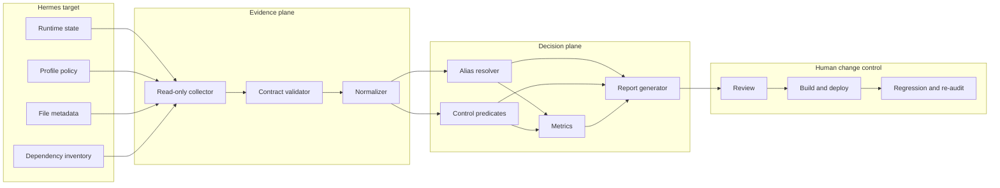

# System Design

## 1. Context

Iris is a security-audit agent attached to a containerized Hermes multi-agent environment. Its purpose is to inspect a bounded set of operational controls, identify risks, and produce a treatment and verification plan without becoming an administrator of the system it assesses.

The design treats an agent-generated report as an untrusted derivative until each material claim can be traced to deterministic evidence. This avoids three common failure modes:

1. an agent infers a passed control from missing data;
2. a scanner's duplicate database identifiers inflate the risk count; and
3. an auditor changes the target during inspection and invalidates its own evidence.

## 2. Functional requirements

| ID | Requirement | Acceptance condition |
|---|---|---|
| FR-01 | Collect runtime identity and container isolation state | UID/GID, capability mask, seccomp, `NoNewPrivs`, and Docker-socket presence are recorded |
| FR-02 | Inspect sensitive profile-file metadata without reading contents | Path, mode, and owner are emitted; credential values are never emitted |
| FR-03 | Inspect selected approval and security policy | Expected keys and observed values are included in the evidence contract |
| FR-04 | Inspect external capability exposure | Tool and MCP exposure are represented explicitly, including empty states |
| FR-05 | Normalize dependency advisories | Package, installed version, identifiers, severity, CVE, title, and fixed version are retained |
| FR-06 | Prevent duplicate vulnerability counts | Aliases for one underlying CVE produce one canonical finding |
| FR-07 | Separate positive, negative, and unknown results | Report contains findings, passed controls, and Not Verified items |
| FR-08 | Produce a governed remediation plan | Every recommendation requires controlled change and post-change verification |
| FR-09 | Support unattended scheduling without unattended approval | Collection and reporting may run on schedule; state-changing approval is denied |

## 3. Non-functional requirements

| Quality attribute | Design decision | Verification |
|---|---|---|
| Determinism | Stable ordering, explicit rules, no network/model call in the public harness | CI byte-compares four generated artifacts |
| Least privilege | Dedicated profile, zero skills, no MCP, no CLI tools, non-root runtime | Operational evidence and control predicates |
| Privacy | Collector avoids values; public fixtures are synthetic; images are sanitized and hashed | Privacy scan and image manifest check |
| Auditability | Stable finding IDs, separate evidence/risk/recommendation, explicit timestamps | JSON findings and Markdown report |
| Fail-closed behavior | Missing or unsafe evidence is rejected or marked Not Verified | Loader/control unit tests |
| Portability | Standard-library Python and an offline Docker execution path | Local tests and Docker CI build |
| Change control | Auditor cannot remediate; human-approved rebuild and regression testing are required | Policy file and report verification plan |

## 4. Trust boundaries

### 4.1 Target boundary

The Hermes runtime and profile files are the assessment target. Iris may observe a specific set of states but must not acquire a general-purpose administration channel. The Docker socket, package manager, service manager, messaging integrations, delegation, and automatic remediation are outside the auditor's authority.

### 4.2 Evidence boundary

Collector output crosses from the target into the analysis plane. It is accepted only when required sections exist and safety declarations confirm that credential values were not read and no mutation or remediation occurred.

### 4.3 Analysis boundary

Normalization and control predicates operate only on accepted evidence. The agent may communicate conditional risk, but it may not claim exploitability or control effectiveness beyond the evidence supplied.

### 4.4 Change boundary

Recommendations cross into a separate human-controlled release process. A finding can be closed only after approved deployment, regression testing, and fresh evidence.

## 5. Component model



## 6. Evidence contract

The input is a versioned JSON document with nine required sections:

- `metadata`
- `profile`
- `runtime`
- `security_files`
- `controls`
- `tools`
- `mcp_servers`
- `advisories_raw`
- `collector_guarantees`

The contract is designed around provenance rather than convenience. Raw advisory records are preserved at ingestion, then replaced by a canonical advisory list in normalized output so that downstream consumers cannot accidentally count both representations.

### Safety invariants

```text
credential_values_read == false
system_modifications_performed == false
automatic_remediation_performed == false
```

If any invariant is false, the loader rejects the evidence before control evaluation.

## 7. Advisory identity resolution

Dependency scanners can return both GHSA and PYSEC identifiers for the same CVE. Iris groups raw records by:

```text
(case-folded package, CVE or normalized title, fixed version)
```

Within each group, the highest normalized severity is retained, the GHSA identifier is preferred as the canonical ID, and every alternate identifier remains attached as an alias. Stable sorting by severity, package, and canonical ID removes nondeterminism from report ordering.

This rule is intentionally conservative: records with different fixed versions are not merged automatically because they may represent different affected ranges or upstream corrections.

## 8. Control evaluation model

Each control is a pure predicate over accepted evidence. A positive result yields a passed-control statement. A negative result yields a typed finding with a stable identifier. When no predicate can be evaluated because evidence is absent, the assessment area is recorded as Not Verified.

The model does not generate a global risk score. A single scalar would combine severity, evidence coverage, and business context without a defensible calibration dataset. Instead, the report exposes severity counts, individual findings, passed controls, and limitations separately.

## 9. Artifact model

One run produces four artifacts:

| Artifact | Purpose | Review use |
|---|---|---|
| `normalized_evidence.json` | Canonical evidence and advisory identities | Trace inputs to findings without duplicate raw records |
| `findings.json` | Stable, machine-readable findings | Integrate with review, ticketing, or policy systems |
| `metrics.json` | Transparent counts and deduplication statistics | Regression and operational monitoring |
| `audit_report.md` | Human-readable governance output | Approval, risk treatment, and closure planning |

The committed sample artifacts are a golden master. CI regenerates them from the same fixture and fails on byte differences.

## 10. Scheduling and idempotence

The operational job binds one stable collector script to the Iris profile and a weekly cron definition. A manual trigger uses the same path as a scheduled execution. Since the collector does not mutate the target and the reference pipeline is deterministic, repeated runs against unchanged evidence are idempotent at the artifact level except for intentionally time-varying metadata.

Operational timestamps remain part of the report scope. Reference fixtures use a fixed timestamp so regression artifacts remain byte-comparable.

## 11. Failure handling

| Failure | Containment behavior |
|---|---|
| Collector command unavailable | Emit Not Collected or fail collection; never install a missing dependency |
| Scanner finds vulnerabilities | Record non-zero scanner exit while completing evidence collection |
| Evidence violates safety contract | Reject before analysis |
| Advisory identity ambiguous | Avoid unsafe merge and retain separate records |
| Control fails | Emit a finding; continue evaluating independent controls |
| Evidence absent | Emit Not Verified; never infer a pass |
| Report generation fails | Preserve machine-readable intermediate artifacts for diagnosis |
| Remediation unverified | Keep the finding open |

## 12. Security and privacy design

- Secrets remain in private environment files and are never part of the public fixture.
- File checks use metadata rather than contents.
- The privacy scanner fails on common credentials, personal paths, shell prompts, email addresses, and private-network ranges.
- Binary screenshots require original-resolution human review because the text scanner does not provide OCR coverage.
- Public image derivatives are registered by byte size and SHA-256 so silent replacement fails CI.
- The offline Compose profile removes networking, drops all capabilities, enables `no-new-privileges`, and uses a read-only root filesystem.

## 13. Ownership boundary

Hermes Agent is an upstream runtime. This repository owns the Iris role and policy design, evidence contract, collector, normalization and deduplication rules, control evaluation, reporting pipeline, privacy controls, reference Docker profile, tests, and documentation. It does not claim authorship of the Hermes platform or provide a compliance certification.
